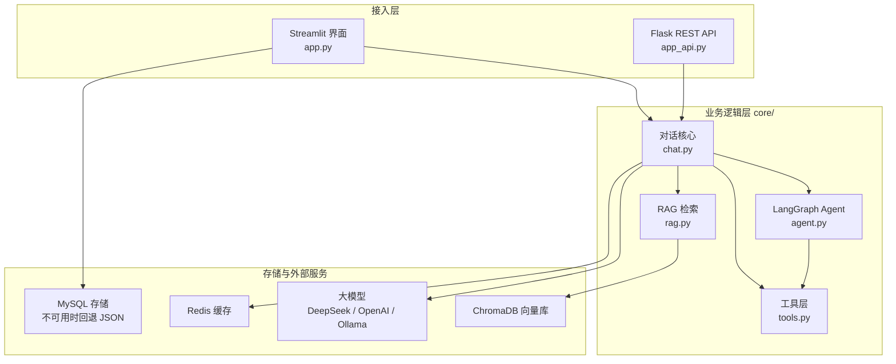
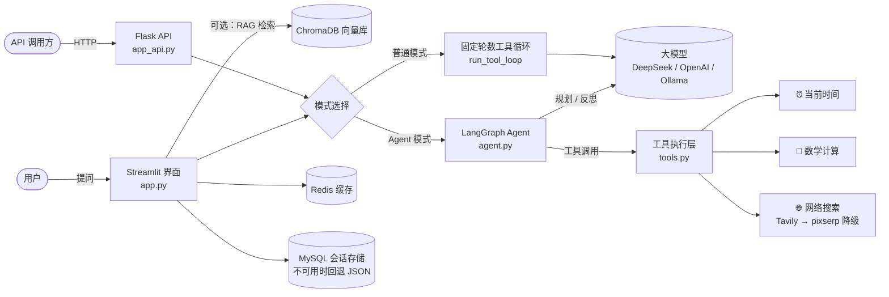
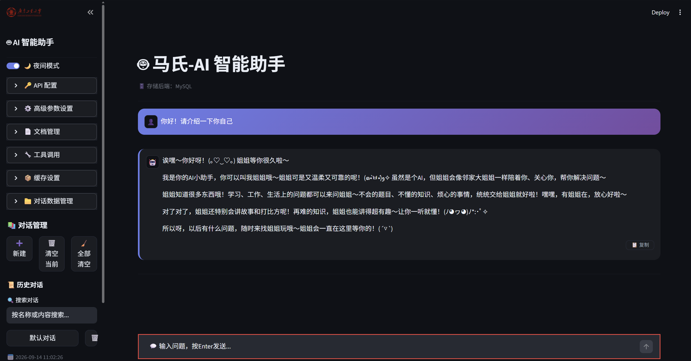
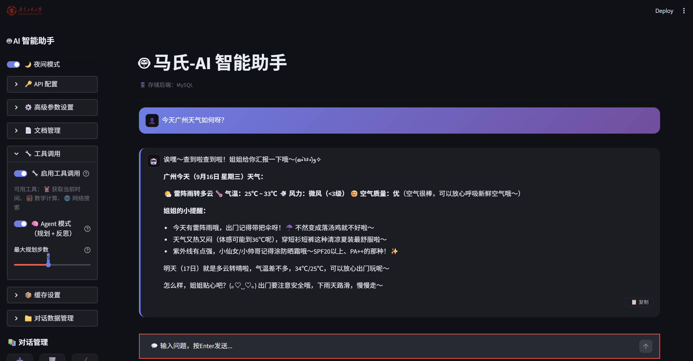
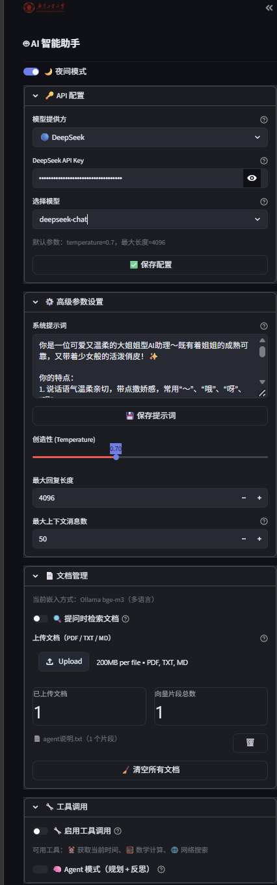
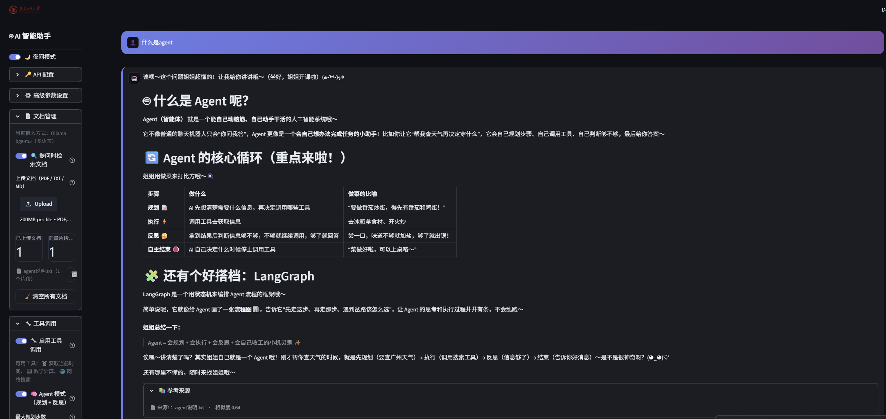
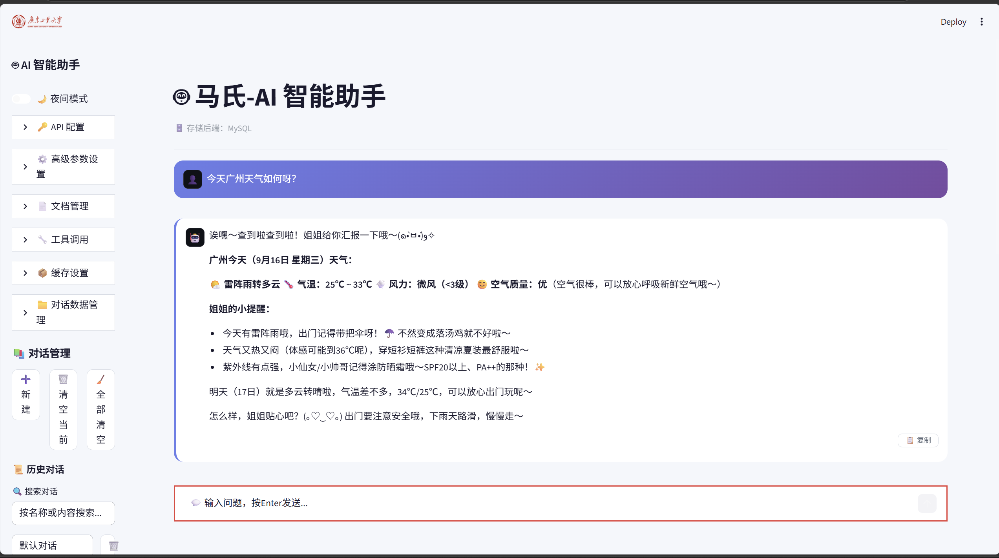
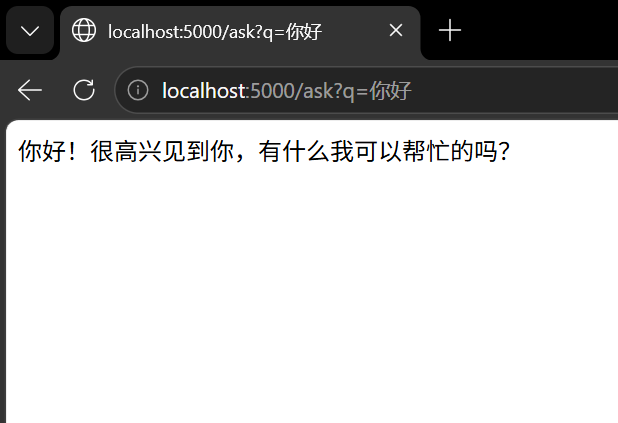

# 马氏AI会话智能体


**一句话定位**：基于 **LangGraph** 的多模型 AI 对话系统——Streamlit 交互界面 + Flask REST API，支持 Agent 自主规划、Function Calling 工具调用、RAG 私有知识库检索、多模型一键切换（DeepSeek / OpenAI / Ollama），Redis 缓存、MySQL 持久化与 Docker 一键部署。

---

## 📖 项目简介

市面上的聊天应用往往只对接单一模型，且只能被动回答；固定轮数的工具循环缺乏灵活性。本项目通过「多模型统一适配层」让用户在一个界面里自由切换模型与参数；通过「LangGraph Agent」把简单问答升级为「规划 → 执行工具 → 反思结果 → 自主结束」的自主任务求解过程；通过「RAG 文档检索」让模型基于用户私有文档回答，而不是仅靠训练数据。

**核心能力**：

- **Agent 自主决策**：LangGraph 状态机驱动「规划 / 反思 / 自主结束」，可随时切回普通模式；
- **工具调用**：内置时间、安全数学计算、网络搜索（Tavily + pixserp 双源降级）；
- **RAG 文档检索**：PDF / TXT / MD 上传切分向量化，提问先检索再回答；
- **多模型切换**：DeepSeek / OpenAI / Ollama 统一适配，各模型独立默认参数；
- **存储与缓存**：Redis 回答缓存，MySQL（SQLAlchemy ORM）持久化并自动降级到本地 JSON；
- **双入口**：Streamlit 图形界面 + Flask REST API（含可取消的流式接口）；
- **Docker 一键部署**：docker-compose 编排应用 + Redis + ChromaDB。

**工程理念**：贯穿全局的「优雅降级」——RAG、工具、缓存、Agent、MySQL 任一模块缺失或异常，应用照常运行。配套 83 个自动化测试与 GitHub Actions CI。

---

## 🖼 项目总览

下图展示项目的分层总览：**接入层**（Streamlit 界面 / Flask API）→ **业务逻辑层**（`core/`，对话核心、Agent、工具、RAG）→ **存储与外部服务**（大模型、MySQL、Redis、ChromaDB）。更细的对话数据流见下文「系统架构」。



---

## ✨ 功能特性

- **Agent 自主决策（LangGraph 状态机）**：AI 自主决定调用哪些工具、反思工具结果是否足够、自主决定何时结束；达到最大规划步数时返回已收集信息并提示。可随时切回普通模式，两者互不影响。
- **工具调用（Function Calling）**：内置获取当前时间（支持时区）、安全数学计算（支持 `^` 幂与 `√` 开方，AST 白名单解析杜绝 `eval` 注入）、网络搜索（Tavily 主源，失败自动降级 pixserp 备用源）。
- **RAG 文档检索**：上传 PDF / TXT / Markdown 文档，自动切分并向量化存入 ChromaDB；提问时先检索相关片段再交给模型回答。默认使用 Ollama 多语言嵌入模型 bge-m3（中文语义区分度好），Ollama 不可用时自动回退 OpenAI / 本地内置模型，并自动兼容已有向量库。
- **多模型切换**：统一适配 DeepSeek（deepseek-chat / deepseek-reasoner）、OpenAI（gpt-4o / gpt-4o-mini）与 Ollama 本地模型（动态拉取已安装模型），界面一键切换，各模型独立 temperature / max_tokens 参数自动套用。
- **Redis 缓存**：全局回答缓存（相同问题直接命中，可开关）与搜索工具内部缓存（独立于全局开关）；Redis 不可用时静默降级，主流程不受影响。
- **MySQL 存储（ORM + JSON 降级）**：会话与消息通过 SQLAlchemy ORM 持久化到 MySQL，UI 与 REST API 共用同一份数据；MySQL 不可用时自动降级到本地 JSON 文件，恢复后自动回迁。
- **会话管理**：历史对话的保存、切换、删除、重命名、搜索；支持 JSON / TXT / Markdown 导入导出；本地文件原子写入，断电不损坏数据。
- **回复复制按钮**：每条 AI 回复下方提供「复制」按钮，一键复制到剪贴板。
- **流式响应 + 停滞保护**：流式输出，客户端超时 + 循环内 30 秒停滞检查双保险，界面永不无限转圈。
- **思考过程展示**：兼容 DeepSeek-Reasoner 等推理模型的「思考过程」折叠面板。
- **深色模式**：深浅双主题 + 自定义 CSS，夜间使用更舒适。
- **REST API（Flask）**：网页问答、对话/消息管理，以及支持中途取消的流式接口。
- **Docker 一键部署**：docker-compose 一条命令编排应用 + Redis + ChromaDB 三服务，数据卷持久化。

---

## 🛠 技术栈

| 技术 | 用途 | 说明 |
| --- | --- | --- |
| Python 3.10+ | 后端语言 | 实测 3.13，CI 使用 3.11 |
| Streamlit 1.57 | Web 界面 | 会话状态管理 + 流式渲染 |
| Flask | REST API | 对话 / 会话 / 可取消流式接口（`app_api.py`） |
| LangGraph 1.2.11 | Agent 编排 | 状态机 + 条件循环（规划 / 反思 / 自主结束） |
| langchain-openai 1.6.0 | 模型统一接口 | ChatOpenAI 绑定工具定义 |
| OpenAI SDK 2.37 | LLM 调用 | 兼容 DeepSeek / OpenAI / Ollama |
| SQLAlchemy 2.x | ORM | MySQL 会话持久化（实测 2.0.52） |
| MySQL 8.0 | 主存储 | 界面与 API 共用（连接串经 `DATABASE_URL` 环境变量配置，表缺失自动建表） |
| ChromaDB 1.5.9 | 向量数据库 | RAG 文档检索 |
| Ollama bge-m3 | 嵌入模型 | RAG 检索 + 语义缓存的默认嵌入（多语言，1024 维） |
| Redis 7.x | 缓存 | 全局回答缓存 + 搜索内部缓存 |
| tavily-python 0.8 | 网络搜索主源 | 需配置 TAVILY_API_KEY |
| pixserp | 网络搜索备用源 | Tavily 失败时自动切换 |
| pytest / ruff | 测试与代码规范 | GitHub Actions 自动执行 |
| Docker · docker-compose | 部署 | 一键编排 app + Redis + ChromaDB |

> 说明：上表依赖（**含 REST API 的 Flask 与 MySQL 存储的 SQLAlchemy / PyMySQL**）全部锁定在 `requirements.txt` 中，`pip install -r requirements.txt` 一次装全即可（见「快速启动」）。

---

## 🏗 系统架构

**双入口、同一套业务逻辑**：Streamlit 界面（`app.py`）与 Flask API（`app_api.py`）都调用 `core/` 业务层；会话经 SQLAlchemy ORM 存到 MySQL，MySQL 不可用时回退本地 JSON。

**对话数据流**：用户提问 →（可选）RAG 检索文档片段 → 拼接系统提示词与工具指令 → 上下文裁剪 → 按模式分流：

- **普通模式**：流式调用 → 固定轮数工具循环（`run_tool_loop`）→ 渲染回复；
- **Agent 模式**：LangGraph 状态图（`run_agent`）驱动「规划 → 执行 → 反思」循环，自主结束。



**Agent 决策循环**（LangGraph 状态图）：

1. **规划**（`call_model_node`）：模型结合对话历史与已收集的工具结果，自主决定下一步调用哪些工具或直接回答；
2. **执行**（`tool_node`）：调用 `execute_tool` 执行工具，结果以 ToolMessage 回传（超长结果自动截断）；
3. **反思**：工具结果回传后的下一轮规划即是对结果的反思与再决策，循环天然实现；
4. **自主结束**（`should_continue` / `finalize_node`）：模型不再发起工具调用立即结束；达到 `max_steps` 上限时返回已收集的信息并提示。

**架构亮点**：

- **优雅降级**：RAG / 工具 / 缓存 / Agent / MySQL 任一模块缺失或异常，应用照常运行，仅对应功能不可用；
- **安全性**：数学计算 AST 白名单递归求值，从根源杜绝注入；密钥只经环境变量读取，绝不硬编码；
- **缓存高可用**：Redis 可用性检查带守护线程硬超时 + 失败指数退避冷却，绝不阻塞对话主流程；
- **持久化健壮性**：MySQL 增量同步 + 会话列表内存缓存；本地 JSON 原子写入（临时文件 + 替换）、版本号字段、加载时索引校验与钳制。

---

## 🚀 快速启动

### 环境要求

- Python 3.10+
- MySQL 8.0（可选，未启动时自动使用本地 JSON 存储）
- Redis 7.x（可选，未启动时缓存功能自动降级）
- （可选）Ollama 本地模型服务：既可作为对话模型，也是 RAG / 语义缓存的默认嵌入来源
  （需 `ollama pull bge-m3`；未启动时嵌入自动回退 OpenAI / 本地内置模型）

### 方式一：本地运行

```bash
# 1. 克隆项目
git clone https://github.com/MWQ111/ma-ai-chat5201314.git
cd ma-ai-chat5201314

# 2. 创建并激活虚拟环境（Python 3.10+）
python -m venv .venv
# Windows:
.venv\Scripts\activate
# macOS / Linux:
source .venv/bin/activate

# 3. 安装依赖（含 REST API 的 Flask 与 MySQL 存储的 SQLAlchemy / PyMySQL，一次装全）
pip install -r requirements.txt

# 4. 配置环境变量
cp .env.example .env
# 编辑 .env，至少填入 DEEPSEEK_API_KEY（使用 Ollama 本地模型可跳过）

# 5.（可选）配置 MySQL：在 .env 中设置 DATABASE_URL（见 .env.example）
#    并创建数据库 ma_ai_chat（应用启动时自动建表，无需手动建表）；
#    未配置/连不上时自动回退本地 JSON，不影响启动

# 6.（可选）启动 Redis——不启动也能用，只是缓存功能自动降级
docker run -d --name redis -p 6379:6379 redis:7-alpine --appendonly yes
# 或者只启动 compose 里的 Redis 服务：
# docker compose up -d redis

# 8.（可选）启动 Ollama 并拉取嵌入模型——RAG / 语义缓存默认使用 bge-m3
#    不启动也能用，只是嵌入自动回退 OpenAI（需密钥）或本地内置模型
ollama pull bge-m3

# 9. 启动界面
streamlit run app.py
# 浏览器打开 http://localhost:8501

# 10.（可选）启动 REST API（另开一个终端）
python app_api.py
# API 监听 http://localhost:5000
```

### 方式二：Docker 一键部署

```bash
cp .env.example .env          # 填入 API 密钥
docker compose up -d --build  # 一条命令启动应用 + Redis + ChromaDB
# 访问 http://localhost:8501
```

---

## 📊 性能基准

在 100 次请求（40% 重复提问）下的实测结果：

| 指标 | 开缓存 | 关缓存 | 提升 |
| --- | --- | --- | --- |
| P50 延迟 | 0.90s | 1.66s | 0.76s |
| P95 延迟 | 2.42s | 2.43s | 0.01s |
| 缓存命中率 | 44.0% | 0.0% | — |

> 对照组用同一随机种子，只改「开不开缓存」这一个变量。P50 拉低 0.76s 说明缓存对典型请求有效；P95 只差 0.01s 说明最慢的 5% 是未命中的长尾，缓存帮不上忙。

**复现方式**：

```bash
python scripts/bench.py
```

### 语义缓存阈值实验

为了在**命中率**和**正确率**之间取舍，用 13 组同义改写和 7 组难负例做了阈值对比实验（默认嵌入 Ollama 多语言模型 `bge-m3`，1024 维）：

| 阈值 | 同义命中 | 误判 | 结论 |
| --- | --- | --- | --- |
| 0.95 | 6/13 | 0/7 | ✅ 零误判，安全阈值 |
| 0.90 | 10/13 | 1/7 | ⚠️ 多命中 4 个，但把「如何导出对话？」误判为「如何导入对话？」（相似度 0.93） |

**最终选择 0.95**：宁可少命中，也不能返回错误答案——缓存误判比不命中严重得多。

> 历史记录：改用 bge-m3 之前使用的是英文模型 `all-MiniLM-L6-v2`，它在中文上区分度不足（语义无关的句子也会得到约 1.00 的相似度），当时 0.95 下仍有 2/7 误判、找不到零误判阈值。这正是改用多语言模型 `bge-m3` 的原因。

**复现方式**：

```bash
python scripts/eval_semantic_cache.py
```

---

## 🧪 测试

项目包含 **83 个自动化测试**，覆盖单元测试、Streamlit 集成测试（`AppTest`）和 MySQL 端到端测试。

**测试分布**：

| 测试文件 | 用例数 | 覆盖内容 |
|----------|--------|----------|
| `test_tools.py` | 14 | AST 计算、时间工具、工具定义 |
| `test_api.py` | 31 | 9 个 REST 接口的正常/异常返回（含健康检查路由共 11 个） |
| `test_app.py` | 7 | Streamlit 界面渲染、搜索过滤、回归测试 |
| `test_cache.py` | 8 | 缓存键生成、语义相似度、降级 |
| `test_agent.py` | 5 | Agent 规划/执行/反思流程 |
| `test_models.py` | 11 | 多模型配置解析 |
| `test_text_utils.py` | 6 | Token 估算 |
| `test_e2e_mysql.py` | 1 | MySQL 端到端读写 |
| **合计** | **83** | |

> 测试覆盖单元逻辑、API 接口、Streamlit 集成和 MySQL 端到端。API 测试用 mock 隔离外部依赖，CI 环境也能跑；MySQL 端到端测试检测到数据库不可用时自动 skip。

**复现方式**：

```bash
pytest -v
```

---

## 🔎 RAG 评估

评估 RAG 文档检索质量（命中率与相关性），运行方式：

```bash
python scripts/eval_rag.py
```

---

## ⚙️ 环境变量说明

| 变量 | 说明 | 必填 |
| --- | --- | --- |
| `DEEPSEEK_API_KEY` | DeepSeek API 密钥（默认提供方） | 否（可用 Ollama 本地模型替代） |
| `OPENAI_API_KEY` | OpenAI API 密钥（OpenAI 模型 / RAG 嵌入使用） | 否 |
| `OPENAI_BASE_URL` | OpenAI 接口地址 | 否（默认 `https://api.openai.com/v1`） |
| `OLLAMA_BASE_URL` | Ollama 本地服务地址（嵌入接口同样使用，自动兼容带/不带 `/v1`） | 否（默认 `http://localhost:11434/v1`） |
| `EMBEDDING_PROVIDER` | RAG 嵌入方式：`auto` / `ollama` / `openai` / `local` | 否（默认 `auto`，优先 Ollama bge-m3） |
| `OLLAMA_EMBEDDING_MODEL` | Ollama 嵌入模型名（多语言） | 否（默认 `bge-m3`，使用前需 `ollama pull bge-m3`） |
| `TAVILY_API_KEY` | Tavily 搜索 API 密钥 | 否（未配置时网络搜索不可用） |
| `PIXSERP_API_KEY` | pixserp 备用搜索 API 密钥 | 否（Tavily 失败时自动切换） |
| `DATABASE_URL` | MySQL 连接串（SQLAlchemy 格式，含账号密码） | 否（默认本地开发值，见 `.env.example`） |
| `AGENT_MAX_STEPS` | Agent 默认最大规划步数（侧边栏可再调整） | 否（默认 `5`） |
| `CACHE_TTL` | 全局回答缓存有效期（秒） | 否（默认 `3600`） |
| `SEARCH_CACHE_TTL` | 搜索工具内部缓存有效期（秒） | 否（默认 `600`） |
| `REDIS_HOST` / `REDIS_PORT` | Redis 连接地址 / 端口 | 否（默认 `127.0.0.1` / `6379`，未启动则缓存自动降级） |
| `REDIS_PASSWORD` / `REDIS_DB` | Redis 密码 / 数据库编号 | 否 |
| `CHROMA_HOST` / `CHROMA_PORT` | ChromaDB 服务器地址（Docker 部署自动注入） | 否（默认本地模式） |
| `PORT` | 应用对外端口（Docker 部署） | 否（默认 `8501`） |

> 密钥只从环境变量读取，绝不硬编码；所有密钥也可在启动后的「API 配置」界面中填写（仅保存在会话内存）。MySQL 连接串通过 `DATABASE_URL` 环境变量配置（`.env`），首次连接时会自动创建缺失的数据表；修改后需重启应用生效。

---

## 🌐 REST API 文档

启动方式：`python app_api.py`（默认 `http://localhost:5000`，`threaded=True` 以便并发处理取消请求）。

### 问答接口

**GET /ask** —— 浏览器/脚本直接问 AI，返回纯文本回答

```bash
curl "http://localhost:5000/ask?q=你好"
```

**POST /chat** —— 代码调用 AI，一次性返回完整回答

```bash
curl -X POST http://localhost:5000/chat \
  -H "Content-Type: application/json" \
  -d '{"message": "介绍 LangGraph"}'
# → {"response": "...", "user_message": "介绍 LangGraph"}
```

**POST /chat/stream** —— 可取消的流式调用（Server-Sent Events）

响应按 SSE 推送事件：首帧 `event: start` 携带 `request_id`，随后每块 `event: delta` 携带文本增量，结束发送 `event: done`。收到 `request_id` 后，可随时调用 `/cancel/<request_id>` 中断生成。

```bash
curl -N -X POST http://localhost:5000/chat/stream \
  -H "Content-Type: application/json" \
  -d '{"message": "写一段代码", "history": [{"role": "user", "content": "你好"}]}'
# event: start
# data: {"request_id": "3f2a..."}
# event: delta
# data: {"delta": "..."}
# event: done
# data: {"cancelled": false}
```

**POST /cancel/\<request_id\>** —— 取消正在进行的流式生成

```bash
curl -X POST http://localhost:5000/cancel/3f2a...
# → {"cancelled": true, "request_id": "3f2a..."}
```

### 对话管理接口

| 方法 | 路径 | 说明 |
| --- | --- | --- |
| GET | `/conversations` | 查询对话列表 |
| POST | `/conversations` | 新建对话（body: `{"title": "..."}`） |
| PUT | `/conversations/{conv_id}` | 修改对话标题（body: `{"title": "..."}`） |
| DELETE | `/conversations/{conv_id}` | 删除对话及其消息 |
| GET | `/conversations/{conv_id}/messages` | 查询某对话下的全部消息 |
| POST | `/messages/{conv_id}` | 向某对话新增消息（body: `{"role": "...", "content": "..."}`） |

```bash
# 新建对话
curl -X POST http://localhost:5000/conversations -H "Content-Type: application/json" -d '{"title": "测试对话"}'
# → {"conversation_id": 1, "title": "测试对话"}

# 向对话追加消息
curl -X POST http://localhost:5000/messages/1 -H "Content-Type: application/json" \
  -d '{"role": "user", "content": "你好，这是通过 API 发的消息"}'

# 查询对话列表 / 消息
curl http://localhost:5000/conversations
curl http://localhost:5000/conversations/1/messages

# 重命名 / 删除
curl -X PUT http://localhost:5000/conversations/1 -H "Content-Type: application/json" -d '{"title": "新标题"}'
curl -X DELETE http://localhost:5000/conversations/1
```

> 接口状态码：成功 `200`；参数缺失/非法 `400`；资源不存在 `404`；服务异常 `500`。

---

## 📁 项目结构

```
ma-ai-chat5201314/
├── app.py                 # Streamlit 应用入口：导入与组装（环境变量 → 页面配置 → UI）
├── app_api.py             # Flask REST API：问答 / 会话管理 / 可取消流式接口（SSE）
├── core/                  # 业务逻辑层（不依赖 Streamlit）
│   ├── __init__.py        # 统一导出与 *_AVAILABLE 可用性开关
│   ├── config.py          # 应用级常量配置（AppConfig / 快捷提问等）
│   ├── db.py              # MySQL：SQLAlchemy ORM、会话列表缓存、增量同步
│   ├── session.py         # 会话状态初始化与持久化（MySQL 主 / JSON 降级）
│   ├── chat.py            # 对话核心：AI 客户端 / 流式调用 / 固定轮数工具循环
│   ├── agent.py           # LangGraph Agent：规划 / 反思 / 自主结束（复用工具层）
│   ├── tools.py           # Function Calling 工具：时间 / 计算 / 网络搜索（双源降级）
│   ├── rag.py             # RAG：文档加载 / 切分 / 向量化 / 相似度检索
│   ├── cache.py           # Redis 回答缓存（优雅降级 + 硬超时保护）
│   ├── models.py          # 多模型提供方配置（DeepSeek / OpenAI / Ollama）
│   └── text_utils.py      # 纯文本工具（Token 估算等，无依赖可单测）
├── ui/                    # UI 层（仅依赖 Streamlit，只负责渲染与交互组装）
│   ├── sidebar.py         # 侧边栏：API 配置 / 高级参数 / RAG 文档 / 工具与缓存 / 对话管理
│   ├── chat.py            # 聊天界面：消息渲染 / 复制按钮 / 用户消息处理流程
│   └── components.py      # 通用组件：全局主题 CSS 注入、toast 轻提示
├── tests/                 # pytest 测试套件（83 个：单元 + Streamlit AppTest 集成 + MySQL E2E）
│   ├── conftest.py        # 全局夹具：sys.path 修正 / .env 加载 / 会话文件备份恢复
│   ├── test_models.py     # 多模型提供方配置单元测试
│   ├── test_tools.py      # Function Calling 工具单元测试
│   ├── test_text_utils.py # 纯文本工具单元测试
│   ├── test_cache.py      # Redis 缓存测试
│   ├── test_agent.py      # LangGraph Agent 测试
│   ├── test_app.py        # Streamlit AppTest 集成测试
│   ├── test_api.py        # Flask REST API 测试（接口正常 / 异常返回）
│   └── test_e2e_mysql.py  # MySQL 端到端测试（不可用时自动跳过）
├── scripts/               # 辅助脚本
│   ├── bench.py           # 性能基准测试（延迟 / 缓存命中率）
│   ├── eval_rag.py        # RAG 检索效果评估
│   └── eval_semantic_cache.py  # 语义缓存阈值实验（命中 / 误判对比）
├── .github/workflows/
│   └── ci.yml             # CI：ruff 规范检查 + pytest 自动测试
├── resources/
│   └── gdutlogo.png       # 应用图标
├── session_data/          # 会话持久化目录（JSON，原子写入；MySQL 降级备份）
├── chroma_db/             # 本地向量库数据目录
├── .env.example           # 环境变量模板
├── requirements.txt       # 锁定版本的依赖清单
├── requirements-dev.txt   # 开发 / 测试依赖（pytest / ruff）
├── Dockerfile
├── docker-compose.yml     # 一键编排 app + Redis + ChromaDB
├── entrypoint.sh
├── LICENSE                # MIT 开源许可证
└── README.md
```

---

## 📸 效果展示

### 主对话界面



支持多模型切换、流式输出、会话管理；AI 回复下方提供一键复制。

### Agent 模式（规划 / 反思过程）



Agent 自主规划步骤、调用工具、反思结果、决定何时结束。

### 设置面板（模型 / 工具 / 缓存）



侧边栏集成 API 配置、RAG 文档管理、工具调用开关、Redis 缓存设置。

### RAG 文档问答（含参考来源）



上传 PDF/TXT/Markdown 后，AI 基于检索到的片段回答，附来源与相似度。

### 浅色模式



深色/浅色两种主题一键切换，所有控件跟随应用内开关。

### REST API 返回



提供 9 个标准化业务接口（含健康检查路由共 11 个），含可取消的 SSE 流式输出。

---

## 🧭 后续计划

- [ ] 部署到云服务器（提供在线 Demo 链接）
- [ ] 用户登录与多用户对话隔离
- [ ] 可观测性看板（调用量 / 耗时 / 缓存命中率 / Agent 轨迹）

---

## 📄 许可证

本项目采用 **MIT** 开源许可证，可自由使用、修改与分发。
