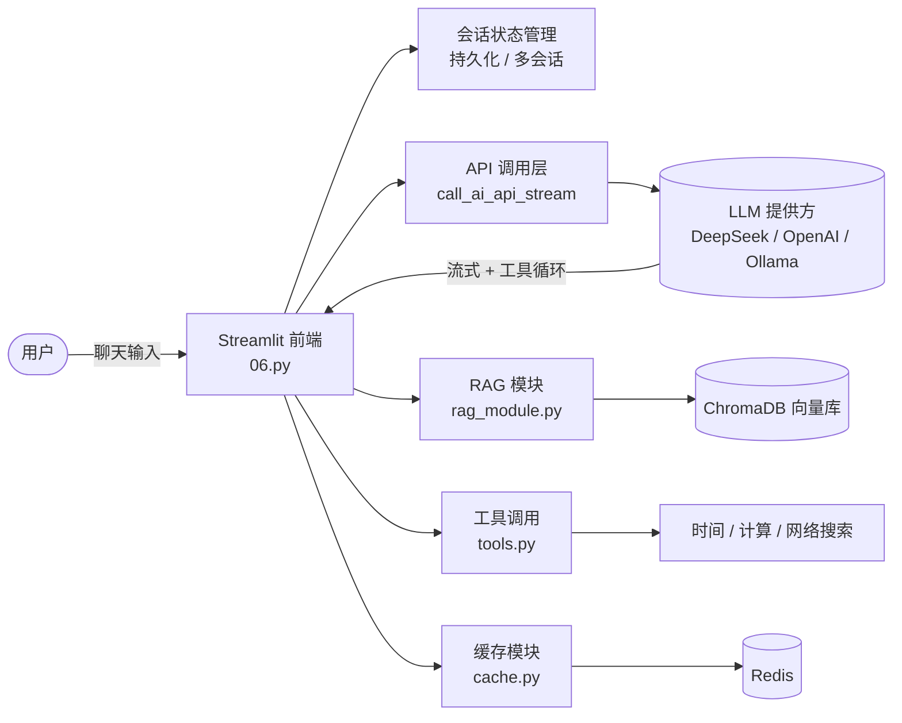

# 马氏AI 智能助手（AI Chat Assistant）


一个基于 **Streamlit** 的 AI 智能对话助手，集成了 **RAG 检索增强生成**、**Function Calling 工具调用**、**多模型提供方适配**、**Redis 回答缓存** 与 **Docker 一键部署**。面向大模型应用开发场景，强调工程健壮性与「优雅降级」设计。

> 项目入口：`06.py`（Streamlit 应用主程序）

---

## ✨ 功能特性

- **多模型提供方**：统一适配 DeepSeek / OpenAI / Ollama（均走 OpenAI 兼容 SDK），支持动态切换模型与独立参数（temperature / max_tokens）。
- **流式响应 + 停滞保护**：流式输出，客户端 read 超时 + 循环内 30 秒停滞检查双保险，避免界面无限转圈。
- **RAG 文档问答**：上传 PDF / TXT / Markdown，自动切分并向量化；提问时先检索相关片段再交给模型回答。支持 OpenAI 嵌入与本地嵌入（ChromaDB 内置 ONNXMiniLM）双方案，自动兼容已有向量库。
- **Function Calling 工具调用**：内置「获取时间 / 数学计算 / 网络搜索」三类工具，多轮工具循环自动执行并回传结果。数学计算使用 **AST 白名单解析**，杜绝 `eval` 注入风险。
- **Redis 回答缓存**：相同问题命中缓存直接返回，降低 API 成本；Redis 不可用时静默降级，主流程不受影响。
- **会话持久化**：本地文件原子写入（临时文件 + 替换）、格式版本号、加载时越界/类型校验，异常自动回退安全值。
- **多会话管理**：新建 / 删除 / 重命名 / 搜索历史对话，支持 JSON / TXT / Markdown 导入导出。
- **思考过程展示**：兼容 DeepSeek-Reasoner 等推理模型的「思考过程」流式展示。
- **深浅色主题 + 自定义 CSS**：两套配色变量集中管理，流式回答期间样式恒定，避免闪变。

---

## 🛠 技术栈

| 领域 | 选型 |
| --- | --- |
| 应用框架 | Python 3.13 · Streamlit 1.57 |
| LLM 调用 | OpenAI Python SDK（兼容 DeepSeek / Ollama） |
| RAG | LangChain（文档加载/切分）· ChromaDB（向量库）· PyPDFLoader |
| 缓存 | Redis 7 |
| 工具 / 搜索 | `ddgs`（DuckDuckGo，免密钥） |
| 部署 | Docker · docker-compose |

---

## 🏗 系统架构



**核心数据流**：用户输入 → RAG 检索（可选）→ 拼接系统提示词 → 上下文裁剪 → 带工具定义的流式 API 调用 →（`run_tool_loop` 多轮工具循环）→ 渲染回复 → 命中则写缓存 → 持久化会话。

---

## 📁 项目结构

```
第三章/
├── 06.py                  # 应用入口：页面渲染 + 主对话逻辑 + 流式/工具循环
├── modules/
│   ├── __init__.py
│   ├── models.py          # 多模型提供方配置（DeepSeek / OpenAI / Ollama）
│   ├── rag_module.py      # RAG：文档加载 / 切分 / 向量化 / 相似度检索
│   ├── tools.py           # Function Calling 工具（时间 / 计算 / 搜索）
│   ├── cache.py           # Redis 回答缓存（优雅降级 + 硬超时保护）
│   └── text_utils.py      # 纯文本工具（Token 估算等，无依赖可单测）
├── tests/                 # pytest 测试套件（单元 + AppTest 集成）
├── .github/workflows/
│   └── ci.yml             # CI：ruff 规范检查 + pytest 自动测试
├── resources/
│   └── gdutlogo.png       # 应用图标
├── Dockerfile
├── docker-compose.yml
├── entrypoint.sh
├── .dockerignore
├── .env.example           # 环境变量模板
├── requirements.txt       # 锁定版本的依赖清单
├── requirements-dev.txt   # 开发/测试依赖（pytest / ruff）
├── pyproject.toml         # ruff 与 pytest 配置
└── README.md
```

---

## 🚀 快速开始

### 方式一：本地运行

```bash
# 1. 安装依赖（建议使用虚拟环境）
pip install -r requirements.txt

# 2. 配置环境变量
cp .env.example .env
# 编辑 .env，至少填入 DEEPSEEK_API_KEY

# 3. 启动
streamlit run 06.py
# 浏览器打开 http://localhost:8501
```

### 方式二：Docker 部署

```bash
cp .env.example .env          # 填入密钥
docker compose up -d --build  # 构建并后台启动（含 Redis）
# 访问 http://localhost:8501
```

---

## 🧪 测试与 CI

```bash
# 安装开发依赖（Windows 若报编码错误，命令前加 PYTHONUTF8=1）
pip install -r requirements-dev.txt

# 代码规范检查
ruff check .

# 运行测试（全部用例不触发真实 API 调用）
pytest -v
```

- **单元测试**：Token 估算（text_utils）、多模型配置与思考过程提取（models）、计算器正确性与注入防护（tools）、缓存静默降级（cache）。
- **集成测试**（Streamlit AppTest）：深浅双模式渲染、对话搜索过滤、消息长度拦截、会话原子写入（版本号 / 无临时文件残留）、损坏会话文件降级。
- **CI**：GitHub Actions 在每次 push / PR 时自动执行 ruff + pytest，仓库首页有状态徽章。

---

## ⚙️ 配置说明（`.env`）

| 变量 | 说明 | 默认值 |
| --- | --- | --- |
| `DEEPSEEK_API_KEY` | DeepSeek 密钥（必填，或界面内填） | 空 |
| `OPENAI_API_KEY` | OpenAI 密钥（RAG 用 OpenAI 嵌入时填） | 空 |
| `OPENAI_BASE_URL` | OpenAI 接口地址 | `https://api.openai.com/v1` |
| `EMBEDDING_PROVIDER` | 嵌入方式：`auto` / `openai` / `local` | `auto` |
| `OLLAMA_BASE_URL` | Ollama 本地服务地址 | `http://localhost:11434/v1` |
| `CACHE_TTL` | 缓存有效期（秒） | `3600` |
| `PORT` | 应用对外端口 | `8501` |

> 密钥只从环境变量读取，绝不硬编码；RAG / Redis / 工具等外部依赖缺失时均自动降级，应用照常运行。

---

## 💡 核心设计亮点（面试可展开）

1. **流式响应的停滞保护**：客户端 `read` 超时与循环内 30 秒间隔检查双保险，既能及时发现断流，又不会干扰正常的长回复。
2. **全面的「优雅降级」**：RAG、工具、缓存、多模型任一模块缺失或异常，应用都照常运行，仅对应功能不可用——通过统一的 `try/except` + 模块级 `AVAILABLE` 标志实现。
3. **安全性**：数学计算工具使用 **AST 白名单递归求值**，从根源杜绝 `eval` 注入；密钥只经环境变量传入。
4. **会话持久化健壮性**：原子写入（临时文件 → `os.replace`）、版本号字段、加载时索引/类型校验与钳制，手工损坏文件也不崩。
5. **缓存高可用**：Redis 可用性检查带守护线程硬超时 + 失败指数退避冷却，绝不阻塞主对话流程。
6. **RAG 嵌入一致性**：自动检测并沿用已有向量库的嵌入方式，避免维度不匹配导致的静默错误。

---

## 📸 界面截图

> 截图待补充，建议放置于 `docs/screenshots/` 并替换以下占位链接：
>
> - 主聊天界面（深浅色主题）
> - RAG 文档管理与检索来源
> - 工具调用 / 思考过程展示
> - 多模型切换与高级参数面板

---

## 🧭 后续可改进

- [ ] 将入口文件 `06.py` 重命名为 `app.py`，项目独立命名，目录从「第三章」学习路径中拆分。
- [ ] 增加用户登录 / 对话权限（当前为单机本地应用）。
- [ ] 接入更丰富的工具（如数据库查询、HTTP 调用）。
- [ ] 提供在线 Demo 链接（Streamlit Cloud / CloudStudio）。

---

## 📄 License

本项目仅供学习与技术展示使用。
